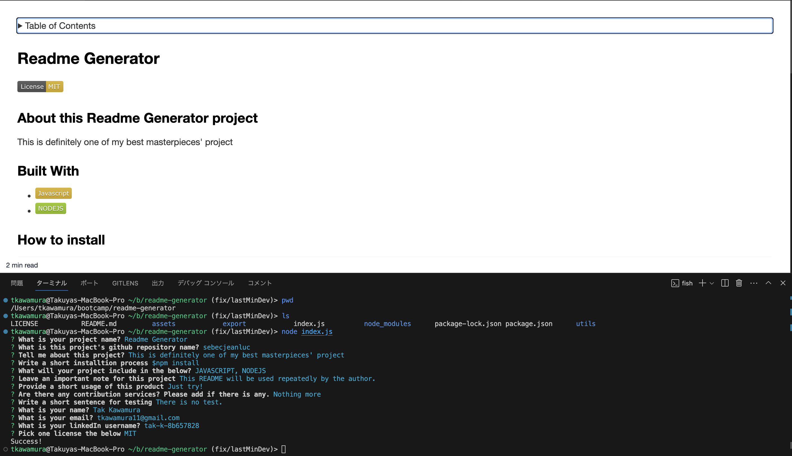

# Readme Generator

## About this project

This project is about developing a command-line application that dynamically generates a professional README.md file for open-source GitHub projects. Utilizing the Inquirer package, the application will simplify the process of creating a detailed README that includes information on the app's purpose, usage, installation, issue reporting, and contribution guidelines. The aim is to enhance the quality of open-source projects and encourage community contributions, while allowing project creators to focus more on development work.

### Built With

- ![JAVASCRIPT]
- ![NODEJS]

### Roadmap

- [x] Develop Command-Line Application

  - [x] Accept user input.

- [x] Implement README Generation with User Input

  - [x] Include sections for:
    - [x] Project Title
    - [x] Description
    - [x] Table of Contents
    - [x] Installation
    - [x] Usage
    - [x] License
    - [x] Contributing
    - [x] Tests
    - [x] Questions

- [x] Dynamic Content Integration

  - [x] Display user-entered project title as README title.
  - [x] Insert user-provided content into respective README sections.

- [x] License Section and Badge

  - [x] Add chosen license badge to README.
  - [x] Include a notice in the License section.

- [x] GitHub and Email Information

  - [x] Add GitHub username with a profile link to the Questions section.
  - [x] Include email address with contact instructions in the Questions section.

- [x] Functional Table of Contents

  - [x] Ensure links navigate to corresponding sections in README.

- [x] Prepare Getting Started Guidelines

  - [x] Create a .gitignore file.
  - [x] Ensure the repository includes a package.json file.

- [x] Fulfill Project Submission Requirements
  - [x] Deliverables:
    - [x] Submit a sample README.
    - [x] Provide the GitHub repository with application code.
  - [x] Walkthrough Video:
    - [x] Create and submit a demonstration video.
    - [x] Include a link to the video in your README file.

### Important note

N/A

### Preview / Demo video

[Demo on youtube](https://www.youtube.com/watch?v=PueJbUTm77Y)
Also the video is available [here](https://drive.google.com/drive/u/0/folders/186fex8fNqKzf1FexZepadjOEu9Sk73qW)

#### This is the Github page

[readme-generator](https://sebecjeanluc.github.io/readme-generator/)

### Credits

This is a practice for the bootcamp. The starter file is protected by the bootcamp.

### Third-party service

- [inquirer - npm](https://www.npmjs.com/package/inquirer)

### License

Distributed under the MIT License. See `LICENSE.txt` for more information.

## Contact

Tak Kawamura - tkawamura11@gmail.com
[Takuya at X](https://x.com/_takuyakawamura)
[Takuya Kawamura Linkedin](https://www.linkedin.com/in/tak-k-8b657828/)

<!-- MARKDOWN LINKS & IMAGES -->
<!-- https://www.markdownguide.org/basic-syntax/#reference-style-links -->

[HTML]: https://img.shields.io/badge/HTML-orange
[CSS]: https://img.shields.io/badge/CSS-blue
[BOOTSTRAP]: https://img.shields.io/badge/BOOTSTRAP-lightblue
[JAVASCRIPT]: https://img.shields.io/badge/Javascript-yellow
[JQUERY]: https://img.shields.io/badge/JQUERY-lightblue
[DAYJS]: https://img.shields.io/badge/DAYJS-orange
[WEBAPI]: https://img.shields.io/badge/WEBAPI-orange
[NODEJS]: https://img.shields.io/badge/NODEJS-green
